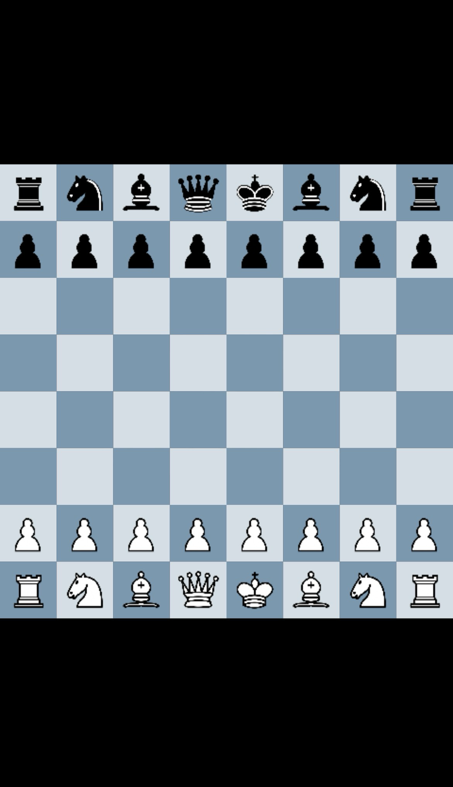

<p align="center">
  
</p>

<h1 align="center">FreeChess ♔</h1>
<p align="center">
  <strong>100% Free. No paywall. No premium. Just Chess.</strong>
</p>

<p align="center">
  <a href="https://lordlolqdh.github.io/FreeChess/"></a>
</p>

<p align="center">
  
  
  
  
  
</p>

---

### 🚀 Live Demo

**https://lordlolqdh.github.io/FreeChess/**

### ✨ Features

- ♟️ **Vollwertiges Schach** - Alle Regeln, inkl. Rochade, En Passant, Promotion
- 🤖 **Stockfish AI** integriert
- 📱 **100% Mobile Ready**
- 🌙 **Dark by Design**
- ⚡ **Ultra Light** - Vanilla JS + Canvas
- 🔊 **Sound Engine**

### 📸 Preview

<p align="center">
  
</p>

### 🛠️ Tech Stack

- **Canvas API** -> Rendering
- **chess.js 1.4.0** -> Move Validation
- **Stockfish.js** -> AI Engine
- **Vanilla JS** -> No bloat

### 📦 Lokal starten

```bash
git clone https://github.com/LordLOLQDH/FreeChess.git
cd FreeChess
# index.html öffnen - fertig!

```
<p align="center"><b>FreeChess stays free.</b></p>
